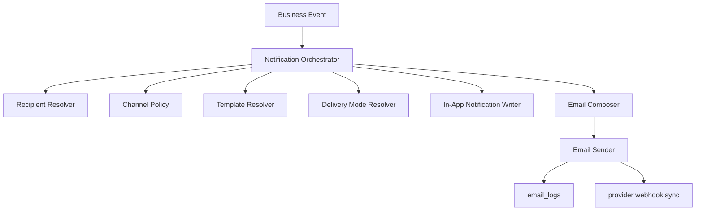

# Notification Email Orchestration Design

**Date:** 2026-03-12

**Status:** approved for implementation

## Problem

当前系统的大量通知仍然主要依赖站内信 / Notification Center，但大多数外部参与者并不会高频登录系统。结果是：

- 作者、审稿人、Academic Editor、Editor-in-Chief 很容易错过关键信息。
- 不同场景的邮件逻辑散落在各个 endpoint / service 中，模板、日志、幂等和审计口径不一致。
- 现有邮件底座缺少统一的 `To / CC / BCC / Reply-To / Attachments` 能力抽象。
- Invoice 仍是链接型邮件，不符合“编辑确认后，一键发送 PDF 附件”的业务要求。
- 邮件发送如果作为流程门禁，会把业务状态机绑死；而实际编辑部有时会改用公司 Gmail 手动发信。

## Goals

- 为绝大多数面向外部角色的通知补齐邮件能力。
- 统一收敛邮件收件人解析、渠道策略、发送模式和审计日志。
- 支持 `To / CC / BCC / Reply-To / Attachments`。
- 把作者类邮件的默认主送规则改为 `corresponding author`，不再默认使用登录邮箱。
- 支持“系统内发送”和“外部 Gmail 已发送补登记”两种路径。
- 确保邮件发送失败或未通过系统发送时，不阻塞业务流程流转。

## Non-Goals

- 本期不做 Gmail API / Outlook API 集成。
- 本期不做运营可视化配置的 `notification_policies` 管理后台。
- 本期不做保存邮件草稿的 `email_drafts` 表。
- 本期不通过邮件发送长期账号密码。

## Confirmed Business Rules

### Audience Policy

- 邮件主要面向外部角色：
  - `author`
  - `reviewer`
  - `academic_editor`
  - `editor_in_chief`
- 内部编辑部用户默认不靠邮件触达：
  - `admin`
  - `managing_editor`
  - `assistant_editor`
  - `production_editor`
  - `owner`

### Recipient Policy

- 所有邮件能力统一支持：
  - `To`
  - `CC`
  - `BCC`
  - `Reply-To`
  - `Attachments`
- 默认业务规则：
  - 作者类邮件：
    - `To = all corresponding authors`
    - `CC = other authors + journal public editorial email`
    - `Reply-To = journal public editorial email`
    - `BCC = empty by default`
  - Reviewer 类邮件：
    - `To = reviewer`
    - `CC = journal public editorial email`
    - `Reply-To = journal public editorial email`
  - AE / EIC 类邮件：
    - `To = target AE/EIC`
    - `CC = journal public editorial email`
    - `Reply-To = journal public editorial email`
- `submission_email` / 登录邮箱仅作为兜底，不再作为作者类邮件的首选主送。
- 所有发送前必须做地址归并去重，避免同一邮箱同时出现在 `To / CC / BCC`。

### Delivery Mode Policy

- `auto`
  - 系统事实型通知，可自动发送。
- `semi_auto`
  - 系统预填正文，编辑发送前确认或补充说明。
- `manual`
  - 强依赖编辑人工表达，或必须确认附件 / 金额 / 对象。

### Workflow Independence Policy

- 邮件不是流程门禁。
- 业务流程状态与沟通状态拆分：
  - `workflow_status` 负责稿件实际状态流转。
  - `communication_status` 负责记录本次通知是否由系统发送、外部发送、跳过或失败。
- 即使 Resend 失败，或编辑改用公司 Gmail 发送，业务流程仍可继续。

## Event Matrix

| Event | Audience | Recipient Rule | Mode | Notes |
|---|---|---|---|---|
| 投稿成功 | Author | To=corresponding authors, CC=other authors + journal mailbox | auto | 作者回执 |
| 技术退修 | Author | 同上 | manual | 编辑必须说明具体问题 |
| 正式修回请求 | Author | 同上 | semi_auto | 基于 reviewer / decision context 预填 |
| 最终 decision | Author | 同上 | auto | accept / reject / reject-resubmit 等 |
| Invoice email | Author | 同上 | manual | 附带 invoice PDF |
| Proofreading 首次通知 | Author | 同上 | auto | 请作者校对 |
| Proofreading 再次通知 | Author | 同上 | semi_auto | 说明仍需修改的问题 |
| Article published | Author | 同上 | auto | 不再单发 production approved |
| Reviewer invitation | Reviewer | To=reviewer, CC=journal mailbox | manual | 支持发送前编辑 |
| Reviewer reminder | Reviewer | To=reviewer, CC=journal mailbox | manual | 支持发送前编辑 |
| Reviewer cancellation | Reviewer | To=reviewer, CC=journal mailbox | auto | 仅在 reviewer 已被联系后触发 |
| First decision request | AE / EIC | To=target AE/EIC, CC=journal mailbox | auto | 请求其接棒给出 first decision |
| Proofreading resubmitted | Internal only | 无外部邮件 | no external email | 只写站内信 / task |
| Production approved | Merged | 不单发 | n/a | 并入 `article published` |

## Recommended Architecture

不要继续在每个业务 endpoint 中各自拼收件人、模板和发送逻辑。统一引入一层通知编排。

### Core Components

- `NotificationOrchestrator`
  - 对外接收业务事件，例如 `author_submission_received`、`invoice_ready_for_send`。
  - 统一决定是否写站内信、是否发邮件、是否生成待确认草稿。
- `RecipientResolver`
  - 统一产出 `to / cc / bcc / reply_to`。
  - 封装作者 / reviewer / AE / EIC 不同收件规则。
- `ChannelPolicy`
  - 决定该事件是：
    - 只站内信
    - 站内信 + 邮件
    - 纯邮件
- `DeliveryModeResolver`
  - 决定该事件走 `auto / semi_auto / manual`。
- `TemplateResolver`
  - 决定模板 key、模板变量、是否允许发送前编辑正文、是否允许附件。
- `EmailSender`
  - 基于统一 envelope 调用 Resend / SMTP。
  - 负责幂等、provider tags、日志写入、附件发送。

## API Design

### Automatic Events

- 不直接暴露给前端。
- 由业务流程内部调用 Orchestrator。
- 返回 `202 Accepted`。
- 适用事件：
  - 投稿成功
  - article published
  - first decision request
  - reviewer cancellation
  - proofreading 首次通知

### Manual / Semi-Auto Events

- 对前端统一提供：
  - `preview`
  - `send`
  - `resend`
  - `mark-external-sent`
- 返回同步结果，便于编辑立即看到发送状态。

### Recommended Endpoints

- 作者类：
  - `POST /api/v1/editor/manuscripts/{id}/emails/technical-revision/preview`
  - `POST /api/v1/editor/manuscripts/{id}/emails/technical-revision/send`
  - `POST /api/v1/editor/manuscripts/{id}/emails/technical-revision/mark-external-sent`
  - `POST /api/v1/editor/manuscripts/{id}/emails/revision-request/preview`
  - `POST /api/v1/editor/manuscripts/{id}/emails/revision-request/send`
  - `POST /api/v1/editor/manuscripts/{id}/emails/revision-request/mark-external-sent`
  - `POST /api/v1/editor/manuscripts/{id}/emails/proofreading/preview`
  - `POST /api/v1/editor/manuscripts/{id}/emails/proofreading/send`
  - `POST /api/v1/editor/manuscripts/{id}/emails/proofreading/mark-external-sent`
- Reviewer 类：
  - 保留现有 reviewer invitation / reminder preview/send 结构
  - 升级为统一支持 `to / cc / bcc / reply_to`
  - 增加 `mark-external-sent`
- Invoice：
  - `POST /api/v1/invoices/{invoice_id}/email/preview`
  - `POST /api/v1/invoices/{invoice_id}/email/send`
  - `POST /api/v1/invoices/{invoice_id}/email/resend`
  - `POST /api/v1/invoices/{invoice_id}/email/mark-external-sent`

### Shared Preview / Send Envelope

- `preview` 响应至少包含：
  - `resolved_recipients`
  - `recipient_source`
  - `subject`
  - `html`
  - `text`
  - `reply_to`
  - `attachments`
  - `warnings`
  - `delivery_mode`
  - `idempotency_key`
  - `can_send`
- `send` 请求至少支持：
  - `subject`
  - `html`
  - `text`
  - `to_override`
  - `cc_override`
  - `bcc_override`
  - `reply_to_override`
  - `idempotency_key`
  - `confirm_send`
  - `attachments_mode`

## External Manual Send Fallback

系统必须允许编辑不走平台内发送，而改用公司 Gmail / Outlook 手动外发，然后回系统补登记。

### UX Actions

- `Send via ScholarFlow`
- `Copy Email Content`
- `Mark as Sent Externally`

### External Send Record Payload

- `channel`
  - `gmail_web | gmail_client | outlook | other`
- `sent_by_user_id`
- `to_recipients`
- `cc_recipients`
- `subject`
- `sent_at`
- `note`
- `external_reference` optional

### Communication Status Values

- `system_sent`
- `system_failed`
- `external_sent`
- `skipped`
- `not_required`

## Data Model Changes

### journals

新增字段：

- `public_editorial_email text`

用途：

- 作者类邮件默认 `CC`
- reviewer / AE / EIC 邮件默认 `CC`
- 默认 `Reply-To`

### email_logs

在现有 `email_logs` 基础上扩展：

- `to_recipients text[]`
- `cc_recipients text[]`
- `bcc_recipients text[]`
- `reply_to_recipients text[]`
- `delivery_mode text`
- `provider text`
- `attachment_count integer`
- `attachment_manifest jsonb`
- `triggered_by_user_id uuid`
- `communication_status text`
- 保留现有 `recipient` 字段用于兼容，可存 `to[0]`

### Deferred to Phase 2

- `email_delivery_events`
  - 用于 webhook 回写 `delivered / bounced / opened / complained`
- `notification_policies`
- `email_drafts`

## Invoice-Specific Flow

- Accept 时只创建 / 更新 invoice，并生成 PDF。
- 不再在 accept 动作中自动给作者发送 invoice link 邮件。
- 编辑在发送前确认：
  - 作者姓名
  - 期刊
  - 金额
  - PDF 已生成
- 系统发送时直接在后端读取 PDF 字节并附加到单封邮件。
- 若编辑改用外部邮箱发送，也可在系统内补记 `external_sent`。

## Permission Model

- 可发送作者类邮件：
  - `managing_editor`
  - `academic_editor`
  - `editor_in_chief`
  - `admin`
- 可发送 reviewer 类邮件：
  - `assistant_editor`
  - `managing_editor`
  - `admin`
- 可发送 invoice 邮件：
  - `managing_editor`
  - `admin`
- `production_editor` 可发送 proofreading 再次通知。
- 作者 / reviewer 端永远不能触发这些后台发送动作。

## Security Notes

- 不允许通过邮件发送长期账号密码。
- Reviewer / AE / EIC 的免登录访问应继续使用系统生成的安全链接或一次性 token。
- 即使编辑改用 Gmail 手动发信，也应从系统复制安全链接，而不是发送凭据。
- `Mark as Sent Externally` 只记录业务事实，不等同于 provider 级投递审计。

## Technical Constraints Verified via Official Docs

以下约束已通过官方文档确认：

- FastAPI `BackgroundTasks` 适合自动邮件这类“响应先返回、任务随后执行”的模式。
- Resend 单封 `/emails` 支持：
  - `cc`
  - `bcc`
  - `reply_to`
  - `attachments`
  - `idempotency`
- Resend batch send 不适合带附件，因此 invoice PDF 必须走单封发送。

参考：

- `https://fastapi.tiangolo.com/tutorial/background-tasks/`
- `https://resend.com/docs/api-reference/emails/send-email`
- `https://resend.com/docs/dashboard/emails/idempotency-keys`

## Rollout Plan

### Phase 1

- 新增 `journals.public_editorial_email`
- 扩展 `email_logs`
- 邮件核心能力升级为统一支持 `To / CC / BCC / Reply-To / Attachments`
- 建立 `NotificationOrchestrator` 与 `RecipientResolver`
- 先打通：
  - reviewer invitation / reminder / cancellation
  - first decision request
  - technical revision
  - revision request
  - proofreading
  - invoice PDF send
- 支持 `mark-external-sent`

### Phase 2

- provider webhook 事件回写
- `email_delivery_events`
- 后续运营可视化和模板 / 状态看板

## Files Likely Affected

- `backend/app/core/mail.py`
- `backend/app/models/email_log.py`
- `backend/app/api/v1/reviews.py`
- `backend/app/api/v1/editor_precheck.py`
- `backend/app/api/v1/editor_heavy_revision.py`
- `backend/app/api/v1/editor_decision.py`
- `backend/app/api/v1/editor_heavy_decision.py`
- `backend/app/api/v1/editor_heavy_publish.py`
- `backend/app/api/v1/invoices.py`
- `backend/app/api/v1/internal.py`
- `backend/app/api/v1/manuscripts_submission.py`
- `backend/app/services/notification_service.py`
- `backend/app/services/first_decision_request_email.py`
- `backend/app/services/reviewer_assignment_cancellation_email.py`
- `backend/app/services/decision_service.py`
- `backend/app/services/decision_service_transitions.py`
- `backend/app/services/invoice_pdf_service.py`
- `backend/app/services/production_workspace_service_workflow_cycle.py`
- `backend/app/services/production_workspace_service_workflow_cycle_writes.py`
- `backend/app/services/production_workspace_service_workflow_author.py`
- `frontend/src/app/(admin)/editor/manuscript/[id]/page.tsx`
- `frontend/src/components/editor/ReviewerEmailPreviewDialog.tsx`
- `frontend/src/services/editor-api/manuscripts.ts`
- `supabase/migrations/*`

## Minimal Success Criteria

- 外部关键通知支持邮件触达，不再只依赖站内信。
- 作者类邮件默认主送 `corresponding author`，并抄送其他作者和期刊公开邮箱。
- Invoice 改为编辑确认后发送 PDF 附件。
- 编辑可在系统内发送，也可外部 Gmail 发送后回系统补登记。
- 邮件发送失败不会阻塞稿件流程状态推进。
