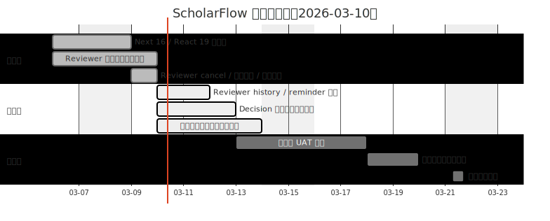

# ScholarFlow 项目进度表与交付路线

**日期**：2026-03-10  
**用途**：用于管理层同步当前系统完善进度、已完成成果、剩余工作和预计时间表。  
**说明**：以下日期为当前工程估算，用于项目节奏管理，不是不可变承诺。

## 0. 管理层 3P 摘要

`📌 ScholarFlow（2026-03-10）`  
`Progress`：已完成 `Next 16 / React 19` 稳定化，reviewer 主链路已打通到“邀请 -> 接受/拒绝 -> 审稿 -> AE 结束外审 -> cancel 未完成 reviewer -> 发取消邮件”。当前 reviewer 第二期需求已经形成闭环，不是停留在设计阶段。  
`Plans`：接下来一周重点不是重写系统，而是继续收 reviewer history / reminder 审计、decision 边界与全链路 UAT 回归，目标在 `2026-03-20` 前形成稳定可用的 UAT 收口版本。  
`Problems`：当前主要风险不在主链路缺失，而在邮件投递观感、HF 运行态偶发漂移、以及多角色流程的长尾边界回归；这些问题已经进入“可验证、可回归、可清单化处理”阶段。

## 1. 执行结论

- 系统已经从“功能验证阶段”进入“业务可试运行阶段”。
- 当前核心链路已经打通：
  - 作者投稿 / 修回
  - ME 技术审查
  - AE 分配与外审组织
  - Reviewer 免登录邀请、接受/拒绝、提交审稿
  - AE 在外审阶段结束时清理未完成 reviewer
  - First / Final Decision 规则收紧
  - Frontend + Backend 部署链路与 HF 运行态门禁
- 当前最重要的结论：
  - reviewer 第二期“取消 / 阶段退出 / 取消邮件”这一批 **已经完成**
  - 剩余工作主要是**收边、邮件可达性完善、全链路 UAT 回归**，不是重新设计核心架构

## 2. 当前整体完成度

| 维度 | 当前判断 | 说明 |
| --- | --- | --- |
| 核心业务主链 | 约 85% | 投稿、审稿、决策、支付/发布主链已基本成形 |
| Reviewer 模块 | 约 90% | 主流程闭环已完成，剩余是 history 展示、提醒细化、可达性优化 |
| Editor / Decision 模块 | 约 80% | first/final decision 边界已收紧，仍需补更多回归和可见性收尾 |
| 部署与运行稳定性 | 约 80% | HF 运行态门禁已补齐，但仍需继续压缩线上偶发不一致风险 |
| UAT 完成度 | 约 70% | 已修多轮问题，但还缺一轮系统化全链路回归 |

## 3. 当前工作做到哪里

### 已完成的闭环

1. **Next 16 / React 19 稳定化**
   - 工具链已统一到 Next.js 16.1.6、React 19
   - 动态路由、params、build、CI 已收敛

2. **Reviewer 邀请主流程**
   - `selected -> invited -> opened -> accepted -> submitted`
   - reviewer 必须显式 Accept 后才能进入 workspace
   - invite 页支持稿件信息预览、PDF 预览、接受/拒绝

3. **Reviewer 审稿工作台**
   - 支持公开评论、私密评论、附件上传
   - 支持 PDF / DOC / DOCX 附件
   - 评论输入区已放大并重新布局
   - 占位 `score=5` 已删除

4. **Reviewer 取消与阶段退出**
   - AE 可以在外审阶段结束时自动/手动 cancel reviewer
   - `selected / invited / opened` 自动 cancel
   - `accepted but not submitted` 必须显式处理
   - `cancelled` reviewer 立即失去访问权限
   - 已接通 cancellation email

5. **Decision 规则收紧**
   - `first decision` 不允许 `accept`
   - `accept` 只允许出现在 `final decision`
   - 外审阶段退出后再进入 decision workspace

6. **部署门禁**
   - GitHub Actions 同步到 HF 后会继续校验：
     - `runtime stage == RUNNING`
     - `runtime sha == repo sha`
     - healthcheck 返回 200
   - 已减少“仓库代码更新，但 HF 运行态还是旧版本”的问题

### 正在推进

1. reviewer history / invitation history 继续贴近真实编辑部使用场景
2. decision 相关只读/可见性边界继续收紧
3. 邮件发送可达性与展示信任度优化（DMARC / return-path / provider 侧完善）
4. UAT 全链路回归准备

### 尚未完成

1. reviewer 历史展示继续增强
2. reminder 审计与 history 细粒度展示
3. AE / EIC 决策流程的更多 E2E 回归
4. 全角色 UAT 回归与发布前问题清零

## 4. 项目进度表（管理视角）

| 工作流 | 状态 | 开始时间 | 目标结束时间 | 当前说明 |
| --- | --- | --- | --- | --- |
| Next 16 / React 19 稳定化 | 已完成 | 2026-03-06 | 2026-03-09 | 已完成版本对齐、构建、CI、部署门禁收敛 |
| Reviewer 邀请与审稿主流程 | 已完成 | 2026-03-06 | 2026-03-10 | 已实现邀请、接受/拒绝、workspace、提交审稿 |
| Reviewer 阶段退出 / cancel / 取消邮件 | 已完成 | 2026-03-09 | 2026-03-10 | 这一批已经形成闭环 |
| Reviewer history / reminder 细化 | 进行中 | 2026-03-10 | 2026-03-12 | 重点是 history 信息密度和编辑部可读性 |
| Decision 边界与可见性收边 | 进行中 | 2026-03-10 | 2026-03-13 | 重点是 first/final decision 规则、E2E 回归 |
| 邮件模板与投递可达性完善 | 进行中 | 2026-03-10 | 2026-03-14 | 模板已接通，剩余是 deliverability 侧优化 |
| 全链路 UAT 回归 | 待开始 | 2026-03-13 | 2026-03-18 | 覆盖 Author / Reviewer / AE / ME / Admin |
| 发布准备与问题清零 | 待开始 | 2026-03-18 | 2026-03-20 | 处理高优先级残留问题，形成稳定发布版本 |

## 5. 当前批次交付的业务含义

“这一批已经形成闭环” 的准确含义是：

- 这一个批次的需求已经不是“只写了设计文档”
- 而是已经完成了：
  - 代码实现
  - 测试回归
  - 云端迁移
  - 主干分支提交与推送

具体到本批次，已经完成的是：

- reviewer `cancel` 正式动作
- `review-stage-exit` 动作
- auto/manual cancel 审计
- cancellation email 模板与发送
- `selected` 不误发取消邮件
- `cancelled` assignment 支持补发取消通知

## 6. 图 1：项目路线图（时间视图）

## 7. 图 2：Reviewer 生命周期状态机

## 8. 图 3：审稿到决策的业务流程

## 9. 当前风险与控制动作

| 风险 | 当前影响 | 已采取动作 | 后续动作 |
| --- | --- | --- | --- |
| 邮件供应商配置不完善 | 邮件可能投递成功但展示信任度不足 | 已修发信链路、已改 sender、已打通 reviewer invitation | 继续完善 DMARC / return-path |
| HF 运行态与仓库代码短时不一致 | 修复代码已推送但线上未立即生效 | 已给 GitHub Actions 增加 HF runtime 收敛门禁 | 继续观察并优化失败日志 |
| reviewer 历史信息仍不够细 | 编辑部追踪决策上下文时信息不够密 | 已补 selected/invited/cancel 审计 | 下一步继续细化 reminder / history |
| UAT 仍在持续暴露长尾问题 | 发布节奏可能被线上偶发问题影响 | 已持续把问题收进测试 | 需要完整一轮回归验证 |

## 10. 建议管理口径

建议对管理层统一采用以下口径：

1. **系统主链路已经不是从零搭建状态**，核心业务已经可跑。
2. **当前重点不是重写系统，而是收边、压问题、做回归**。
3. **reviewer 这条最复杂的链路已经基本打通**，当前剩余是历史细化和稳定性增强。
4. 预计在 **2026-03-20** 前形成一个可用于持续开展编辑部工作的稳定版本。
