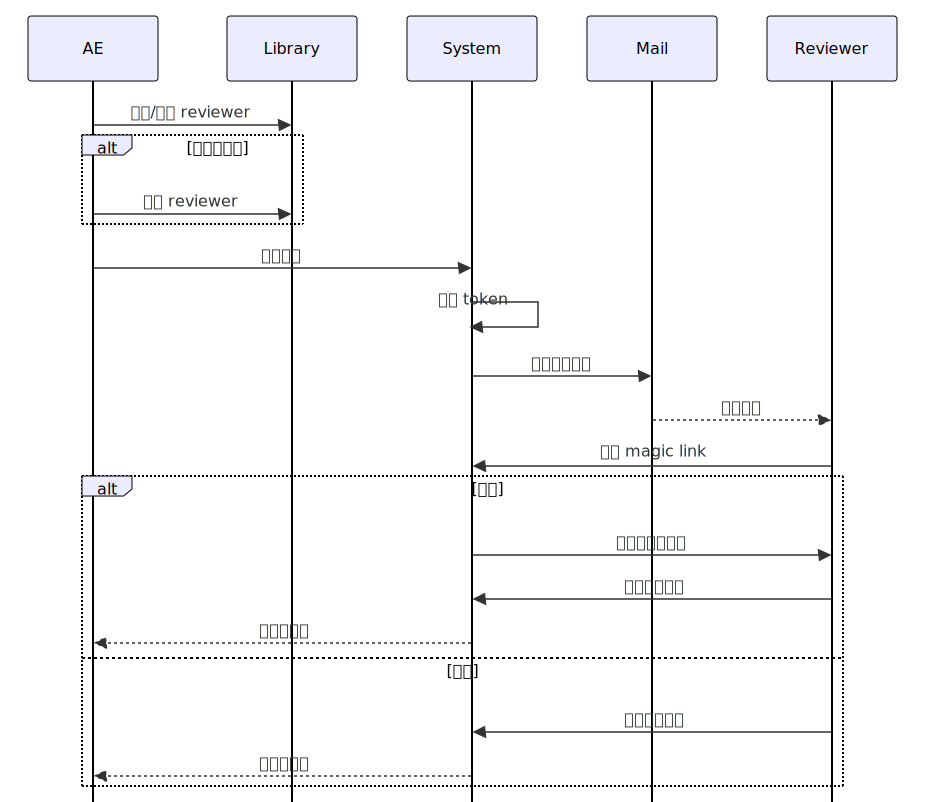

**日期**: 2026-02-10  
**依据**: `docs/original_version` + 当前 UAT 反馈  
**重点修订**: 将前序流程统一为“ME 先技术审查，通过后再分配 AE”

## 1. 文档目的

本版用于明确 ScholarFlow 的标准稿件处理链路，确保角色分工、状态机和系统实现一致，重点解决以下问题：

1. 前序节点顺序不一致（已统一为 ME 先审后分配 AE）。
2. 大修/小修分流规则在执行层口径不一致。
3. 学术决策与运营执行边界需要更清晰。

---

## 2. 标准处理流程（新版）

1. **作者投稿**：作者提交稿件与基础元数据。
2. **ME 技术审查**：检查格式完整性、基础合规、文件有效性；不通过则退回作者。
3. **ME 分配 AE**：仅在技术审查通过后执行。
4. **AE 组织外审**：从 Reviewer Library 选择并邀请审稿人。
5. **审稿人回执**：接受/拒绝/超时；不足则继续邀请。
6. **审稿报告达标**：AE 汇总意见并提交学术决策。
7. **EIC/编委终审**：给出拒稿、小修、大修、接收。
8. **小修分支**：作者修回后由 AE 核查，再提交终审。
9. **大修分支**：作者修回后必须二审，再进入终审。
10. **接收后并行**：Production 与 Finance 同时启动。
11. **发布门禁**：需同时满足 `Paid` 与 `Proof Ready`。
12. **正式发布**：公开检索、引用与下载链路生效。

---

## 3. 稿件全生命周期（宏观流程图）

---

## 4. 状态机（系统流转约束）

> 约束强调：`under_review` 不允许直接拒稿，必须进入 `decision` 节点由学术角色做最终判断。

---

## 5. 审稿邀请机制（Magic Link）

---

## 6. 角色边界（执行口径）

| 角色 | 主要职责 | 不负责事项 |
| :--- | :--- | :--- |
| Author | 投稿、修回、校对确认 | 学术决策、审稿人管理 |
| ME (Managing Editor) | 投稿入口技术审查、AE 分配、流程监管 | 学术终审 |
| AE (Assistant Editor) | 组织外审、催审、汇总审稿意见、修回跟进 | 最终学术拍板 |
| EIC/Board | 学术 Pre-check、Final Decision（拒稿/修回/接收） | 日常流程操作 |
| Reviewer | 提交同行评审意见（Magic Link） | 系统后台管理 |
| Production | 排版、校对流转、发布前制作准备 | 财务到账确认 |
| Finance | 开票、到账确认、账单状态管理 | 学术意见判断 |

---

## 7. 与原版相比的关键变化

1. **前序顺序修正**：明确“ME 技术审查 -> ME 分配 AE”，杜绝先分配后审查。
2. **修回规则固化**：小修可由 AE 核查后再决策；大修必须进入二审。
3. **门禁表达清晰**：发布由财务与制作双条件共同放行。
4. **图形标准统一**：本版图示全部采用 `SVG` 矢量图，适配放大打印。

---

## 8. 实施建议（对接当前系统）

1. 将 `/editor/intake` 固化为 ME 入口页面，仅处理技术审查与 AE 分配。
2. 将 `/editor/workspace` 聚焦 AE 的外审执行与修回推进。
3. 将 `/editor/academic` 聚焦 EIC/Board 的学术判断，保持决策日志可追溯。
4. 发布按钮继续受 Payment Gate + Proof Gate 双重约束。
