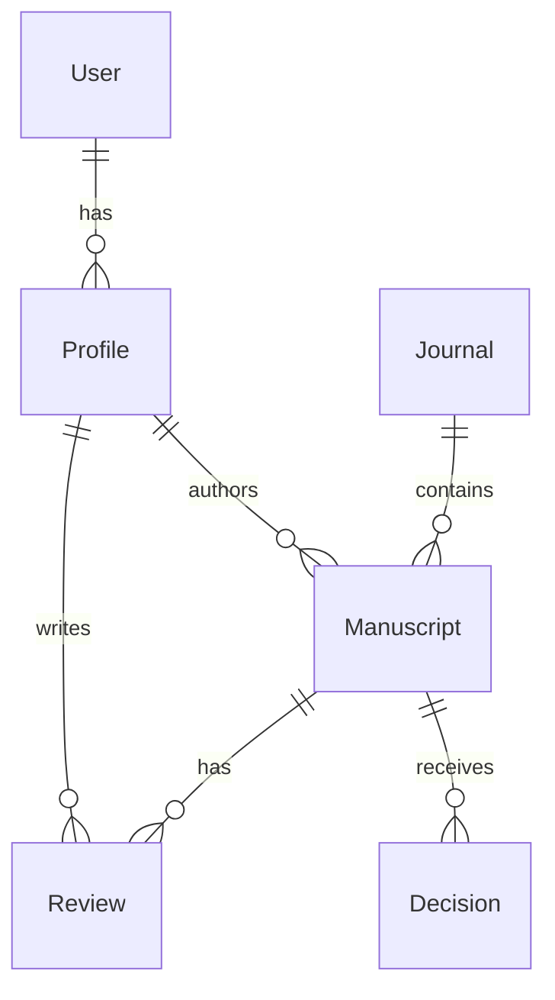

# Data Model for E2E Regression Testing

## Overview
This document defines the "Seed Data" schema used for End-to-End (E2E) regression testing in Scholar Flow. It ensures a consistent starting state for all automated tests.

## 1. DB Reset Strategy

To ensure test isolation and reliability, the database must be reset to a known state before each test suite execution (or individual test, depending on the strategy).

### Strategy: `TRUNCATE` + `SEED`
1.  **Truncate**: Efficiently clear all operational tables using `TRUNCATE TABLE ... CASCADE`.
    *   **Target Tables**: `users`, `profiles`, `journals`, `manuscripts`, `reviews`, `decisions`, `notifications`, etc.
    *   **Preserved Tables**: `migrations` (schema versioning), static reference data (if any).
2.  **Seed**: Re-populate the database with the "Standard Seed Data" defined below.

**Implementation Note**:
- This logic will be exposed via the `POST /api/v1/internal/reset-db` endpoint.
- Only enabled when `GO_ENV` (or `ENV`) is `test` or `development`.

## 2. Seed Data Schema

### 2.1. Standard Users
A set of pre-defined users with fixed credentials to cover all system roles.

| Role | Email | Password | UUID (Fixed) | Description |
| :--- | :--- | :--- | :--- | :--- |
| **Author** | `author@example.com` | `password123` | `11111111-1111-4111-a111-111111111111` | Standard author for submission flows. |
| **Reviewer 1** | `reviewer1@example.com` | `password123` | `22222222-2222-4222-a222-222222222222` | Reviewer for assigning tasks. |
| **Reviewer 2** | `reviewer2@example.com` | `password123` | `33333333-3333-4333-a333-333333333333` | Secondary reviewer. |
| **Editor** | `editor@example.com` | `password123` | `44444444-4444-4444-a444-444444444444` | Managing Editor for decision making. |
| **Admin** | `admin@example.com` | `password123` | `55555555-5555-4555-a555-555555555555` | System administrator. |

### 2.2. Journals
Baseline journal configuration.

| Field | Value |
| :--- | :--- |
| **Title** | `Journal of Advanced Testing` |
| **Code** | `JAT` |
| **Description** | `A journal dedicated to testing the Scholar Flow platform.` |
| **Editor ID** | `44444444-4444-4444-a444-444444444444` (Editor) |

### 2.3. Manuscripts (Initial State)
Pre-created manuscripts to bypass the "Create Submission" step for tests focusing on later stages (e.g., Review, Decision).

#### Manuscript A: "Submitted"
- **Title**: "The Impact of Automated Testing"
- **Author**: `author@example.com`
- **Status**: `submitted`
- **Journal**: `JAT`

#### Manuscript B: "Under Review"
- **Title**: "Algorithms for Peer Review"
- **Author**: `author@example.com`
- **Status**: `under_review`
- **Assigned Reviewers**:
    - `reviewer1@example.com` (Status: `pending`)

#### Manuscript C: "Accepted"
- **Title**: "Finalized Research Paper"
- **Author**: `author@example.com`
- **Status**: `accepted`

#### Manuscript D: "Rejected"
- **Title**: "Flawed Methodology"
- **Author**: `author@example.com`
- **Status**: `rejected`

## 3. Data Relationships Map

## 4. Environment Variables
The following environment variables are required for the seeding process:

- `TEST_DB_URL`: Connection string for the test database.
- `SUPABASE_SERVICE_ROLE_KEY`: To bypass RLS during seeding.
