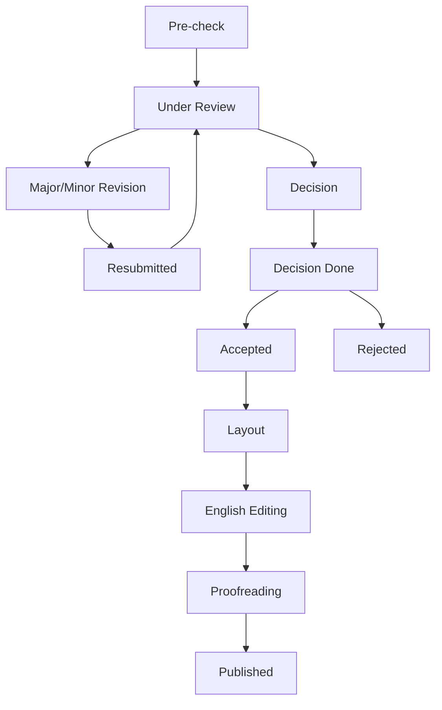

# Data Model: Workflow and UI Standardization

## Entities

### Manuscript (Updated)
Extends the existing manuscript entity with new status and invoice metadata.

| Field | Type | Description |
|---|---|---|
| `status` | Enum | 12 states: `pre_check`, `under_review`, `major_revision`, `minor_revision`, `resubmitted`, `decision`, `decision_done`, `approved`, `layout`, `english_editing`, `proofreading`, `published`, `rejected` |
| `invoice_metadata` | JSONB | Contains `authors`, `affiliation`, `apc_amount`, `funding_info` |
| `owner_id` | UUID | FK to `user_profiles` (Internal Owner) |
| `editor_id` | UUID | FK to `user_profiles` (Assigned Editor) |
| `submitted_at` | TIMESTAMPTZ | Creation timestamp |
| `updated_at` | TIMESTAMPTZ | Last status change timestamp |

### Reviewer Library (Updated UserProfile)
Extends `user_profiles` for academic details.

| Field | Type | Description |
|---|---|---|
| `title` | Text | Academic title (e.g., Prof., Dr.) |
| `affiliation` | Text | Institution |
| `research_interests`| Text[] | List of keywords |
| `homepage_url` | Text | Optional personal site |

### Status Transition Log
New table for auditing lifecycle changes.

| Field | Type | Description |
|---|---|---|
| `id` | UUID | Primary Key |
| `manuscript_id` | UUID | Link to manuscript |
| `from_status` | Text | Previous state |
| `to_status` | Text | New state |
| `changed_by` | UUID | Link to user |
| `created_at` | TIMESTAMPTZ | precise transition time |

## State Transitions

